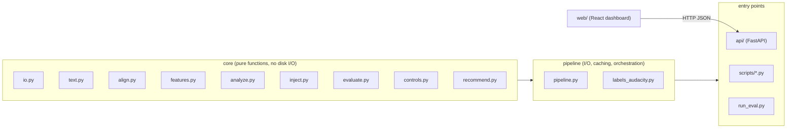

# SpeechLens Architecture

> **Track C — Contrastive Speech Analytics & Temporal Flaw Grounding**
> Multimodal AI Hackathon 2026 (IIT Mandi). Solo project. Target submission 2026-10-14.

---

## 1. Purpose

Given a participant recording and its transcript, compare against an ideal baseline reading of the same text and report:

| What | How |
|---|---|
| **Where** the delivery deviates | Word-level timestamps and merged regions |
| **What** the flaw is | `rushed`, `dragging`, `monotone`, `long_pause`, `volume_drop`, `muffled` (detector also emits `erratic_pitch`, `missing_pause`, `volume_spike`) |
| **How large** the deviation is | Observed value, reference value, threshold, magnitude (multiple of threshold) |
| **Why** it was penalised | Human-readable explanation (`explain()`) and per-region rubric penalty |

**Out of scope:** XGBoost/learned classifiers, embeddings, ASR, multilingual support, real-time streaming, user accounts, database, any "confidence %" output.

---

## 2. Design Invariants

1. **No fake confidence.** Every region carries numeric evidence. Reliability = empirical numbers from the frozen eval.
2. **Speaker-agnostic features.** Pitch: semitones relative to speaker median. Energy: dB relative to speaker median. MFCCs: cepstral mean normalisation (CMN).
3. **Single source of truth for thresholds and rubric constants.** Currently hard-coded in `analyze.py` (`FLOORS`, `K_MAD`, `SCORE_GAIN`, `DIMENSIONS`); planned migration to `configs/default.yaml`.
4. **Synthetic and real data never mix.** Evaluated and reported separately.
5. **Threshold freeze.** Tune on speeches 1–2, `git tag thresholds-frozen`, evaluate speech 3 once.
6. **Determinism.** Injection seeded via CRC32 (`inject.seed_for()`). Dependencies pinned.
7. **Rule-based text.** Explanations are templates in `explain()`. No LLM calls.
8. **Naming honesty.** `muffled` detects high-frequency loss (> 3 kHz power share), not articulation. Label it "Muffled (high-frequency loss)".

---

## 3. Layering and Dependency Rule



**Rule:** `web -> api -> pipeline -> core`. Core never imports from pipeline/api/scripts. Scripts use pipeline and core. Web talks only to the API.

> [!NOTE]
> `io.py` and `text.py` live in core today. `align.py` imports from both. `features.py`, `analyze.py`, and `inject.py` import from core siblings only.

---

## 4. Repository Layout

```
speechlens/                          (repo root)
├── README.md                        [EXISTS]
├── ARCHITECTURE.md                  [THIS FILE]
├── DATA_LICENSES.md                 [PLANNED]
├── requirements.txt                 [EXISTS] numpy, scipy, librosa, soundfile, parselmouth, pytest
│                                              torch/torchaudio 2.5.1 commented (alignment only)
├── configs/
│   └── default.yaml                 [PLANNED] thresholds, floors, MAD k, rubric constants
├── speechlens/
│   ├── __init__.py                  [EXISTS] defines SR = 16000
│   ├── align.py                     [EXISTS] MMS_FA forced alignment
│   ├── features.py                  [EXISTS] F0, energy, HF share, CMN-MFCC, word_table()
│   ├── analyze.py                   [EXISTS] deltas, regions, explain(), score(), analyze()
│   ├── inject.py                    [EXISTS] 6 flaws x 4 severities, labels + re-timed alignments
│   ├── evaluate.py                  [EXISTS] iou(), match(), boundary_errors()
│   ├── io.py                        [EXISTS] load_audio(), save_audio()
│   ├── text.py                      [EXISTS] normalize_words(), save/load_alignment()
│   ├── schemas.py                   [PLANNED] Pydantic models
│   ├── config.py                    [PLANNED] load/validate configs/default.yaml, config hash
│   ├── controls.py                  [PLANNED] negative controls
│   ├── recommend.py                 [PLANNED] rule-based recommendation templates
│   ├── pipeline.py                  [PLANNED] orchestration with disk cache
│   ├── labels_audacity.py           [PLANNED] Audacity label -> project label JSON
│   └── api/
│       ├── main.py                  [PLANNED] FastAPI app
│       └── storage.py               [PLANNED] file-based store keyed by sha256
├── scripts/
│   ├── make_synthetic_baseline.py   [EXISTS] espeak-ng fixture builder
│   ├── build_dataset.py             [EXISTS] flawed + mixed + controls + manifest.csv
│   ├── run_eval.py                  [EXISTS] per-type P/R/F1, boundary MAE, severity recall
│   ├── analyze_cli.py               [EXISTS] single-file analysis CLI
│   ├── check_alignment.py           [PLANNED] (brief says EXISTS, but file is absent)
│   ├── import_audacity_labels.py    [PLANNED]
│   └── run_all.ps1                  [PLANNED] one-shot reproduce
├── data/
│   ├── baseline/                    [EXISTS, empty] baseline wav files
│   ├── flawed/                      [EXISTS, empty] injected flawed files
│   ├── labels/                      [EXISTS, empty] label JSONs from inject.py
│   ├── alignments/                  [EXISTS, empty] alignment JSONs
│   └── transcripts/                 [PLANNED] transcript .txt files
├── eval/
│   └── synthetic_fixture_results.json  [EXISTS] frozen synthetic eval output
├── web/                             [PLANNED] Vite + React + TypeScript
├── tests/
│   └── test_pipeline.py             [EXISTS] 10 test cases (5 functions, 1 parametrised x6)
└── docs/                            [PLANNED] 6-page technical doc, JSON schemas, figures
```

> [!IMPORTANT]
> The brief describes `data/synthetic/` and `data/real/` subdirectories. The current repo uses a flat `data/{baseline,flawed,labels,alignments}/` layout. The split (synthetic vs real) is tracked through `manifest.csv`, not directory structure.

---

## 5. Component Specifications

### 5.1 `align.py` — Forced Alignment [EXISTS]

| Item | Detail |
|---|---|
| Function | `align_words(audio_path, transcript, device="cpu")` |
| Input | Audio file path + transcript string |
| Output | `[{"word": str, "start": float, "end": float}, ...]` |
| Backend | `torchaudio.pipelines.MMS_FA` (CTC aligner). No fallback implemented yet. |
| Normalisation | Delegates to `text.normalize_words()` (lowercase, a-z + apostrophe) |
| Gate | 10-20 words spot-checked in Audacity to ~50 ms before any dataset work |

### 5.2 `features.py` — Feature Extraction [EXISTS]

| Item | Detail |
|---|---|
| Function | `extract(y, sr=16000) -> Features` dataclass |
| F0 | Parselmouth `to_pitch_ac`, semitones relative to speaker median, octave-error clamp (`_drop_octave_jumps`: > 12 st from median or > 6 st from local median -> NaN) |
| Energy | librosa RMS -> dB relative to speaker median speech level (active frames = > 10th-percentile + 12 dB) |
| HF share | `10 * log10(power_above_3kHz / total_power)` in dB |
| MFCCs | 13 coefficients, cepstral mean subtracted |
| Constants | `HOP=160` (10 ms), `WIN=400` (25 ms), `NFFT=512`, `HF_CUTOFF_HZ=3000` |

**`word_table(feat, words) -> dict[str, ndarray]`:**

| Column | Description |
|---|---|
| `dur` | Word duration (seconds) |
| `gap` | Silence before the word (seconds; 0 for the first word) |
| `energy` | Mean speaker-normalised dB over the word span |
| `hf` | Mean HF-share dB over the word span |
| `pitch_range` | p90 - p10 of F0 (semitones) over a 3-word window (NaN if < 8 voiced frames) |
| `pitch_med` | Median F0 (semitones) over a 3-word window |

### 5.3 `analyze.py` — Comparison Engine [EXISTS]

#### Delta Definitions

| Feature | Delta formula | Positive = | Negative = |
|---|---|---|---|
| Rate | `ln(dur_P / dur_B)` (robust-centred) | dragging | rushed |
| Pause | `gap_P - gap_B` (robust-centred) | long_pause | -- |
| Missing pause | `gap_B >= 0.35 and gap_P < 0.1` | -- | missing_pause |
| Pitch range | `ln((range_P + 0.5) / (range_B + 0.5))` (robust-centred) | erratic_pitch | monotone |
| Energy | `E_P - E_B` (robust-centred) | volume_spike | volume_drop |
| Clarity | `HF_P - HF_B` (robust-centred) | -- | muffled |

#### Thresholding

```
threshold = max(floor, K_MAD * 1.4826 * MAD)
```

| Feature | Floor | K_MAD |
|---|---|---|
| rate | 0.30 | 3.0 |
| pause | 0.35 | 3.0 |
| pitch | 0.30 | 3.0 |
| energy | 5.0 dB | 3.0 |
| clarity | 4.0 dB | 3.0 |

#### Region Merging (`_runs`)

Consecutive flagged words merge into regions. Gaps of <= 1 unflagged word between flagged words are closed. Minimum region length: 2 words (3 for pitch and volume types).

#### `explain(region) -> str` [EXISTS]

Template-based causal explanation keyed on `region["type"]`. Includes observed vs reference values, delta, and threshold multiple. No LLM.

#### `score(regions, speech_duration) -> dict` [EXISTS]

| Dimension | Flaw types | Weight |
|---|---|---|
| `pace` | rushed, dragging | 0.20 |
| `pausing` | long_pause, missing_pause | 0.20 |
| `expressiveness` | monotone, erratic_pitch | 0.25 |
| `volume` | volume_drop, volume_spike | 0.15 |
| `clarity` | muffled | 0.20 |

Formulas (exactly as in code):
```
dim = 100 * exp(-15 * sum(duration_fraction * (0.3 + 0.7 * severity)))
overall = 0.5 * weighted_mean + 0.5 * min(all dimensions)
```

Where `severity = clip((magnitude - 1) / 3, 0, 1)` — a **normalised 0-1 float**, not the 1-4 integer severity from `inject.py`.

#### `analyze(y_p, words_p, y_b, words_b) -> dict` [EXISTS]

Top-level entry point. Returns:

```json
{
  "scores": { "pace", "pausing", "expressiveness", "volume", "clarity", "overall" },
  "regions": [ "..." ],
  "global": { "speech_duration_s", "articulation_wps", "pause_time_s", "f0_median_hz" },
  "series": { "t", "participant": { "f0_st", "energy_db", "hf_db" },
                    "baseline":    { "f0_st", "energy_db", "hf_db" } },
  "words": [ { "word", "start", "end" } ]
}
```

> [!NOTE]
> No `meta` key exists yet (planned: input hashes, config hash, git commit, alignment backend, versions).

### 5.4 `inject.py` — Flaw Injection [EXISTS]

| Item | Detail |
|---|---|
| Flaws | `["rushed", "dragging", "monotone", "long_pause", "volume_drop", "muffled"]` |
| Severities | 1 (almost perfect) to 4 (botched) |
| Seeding | `seed_for(*parts)` -> CRC32 of `"\|".join(parts)` |
| Entry | `make_flawed(y, words, plan, sr) -> (audio, words, regions)` |
| Plan item | `{"flaw", "severity", "i", "j", "seed"}` |

**Severity parameter table (from code):**

| Flaw | Sev 1 | Sev 2 | Sev 3 | Sev 4 | Unit |
|---|---|---|---|---|---|
| rushed | 1.15 | 1.35 | 1.65 | 2.0 | speed-up factor |
| dragging | 1/1.15 | 1/1.35 | 1/1.65 | 1/2.0 | speed-down factor |
| monotone | 0.2 | 0.45 | 0.7 | 0.9 | fraction of pitch excursion removed |
| long_pause | 0.4 | 0.8 | 1.4 | 2.2 | seconds of silence inserted |
| volume_drop | -3 | -6 | -10 | -16 | dB |
| muffled | 6000 | 4000 | 2800 | 1800 | low-pass cutoff Hz |

**Region dict emitted by `inject.py`:**

```json
{ "type", "severity", "start", "end", "word_start", "word_end", "base_start", "base_end" }
```

### 5.5 `evaluate.py` — Evaluation Utilities [EXISTS]

| Function | Signature | Description |
|---|---|---|
| `iou(a, b)` | Two `(start, end)` tuples -> float | Interval IoU; degenerate fallback if union <= 0 |
| `match(pred, truth, iou_thr=0.3, require_type=True)` | -> `(pairs, unmatched_pred, unmatched_truth)` | Greedy one-to-one matching |
| `boundary_errors(pred, truth, pairs)` | -> `[(d_start, d_end), ...]` | Absolute boundary error per matched pair |

### 5.6 `io.py` — Audio I/O [EXISTS]

| Function | Description |
|---|---|
| `load_audio(path, sr=16000)` | librosa load -> float32 mono |
| `save_audio(path, y, sr=16000)` | soundfile write, clip to [-1, 1], PCM_16 |

### 5.7 `text.py` — Text Utilities [EXISTS]

| Function | Description |
|---|---|
| `normalize_words(text)` | Lowercase, a-z + apostrophe tokens |
| `save_alignment(path, words)` | Write `{"words": [{word, start, end}]}` JSON |
| `load_alignment(path)` | Read and return `words` list |

### 5.8 Planned Components

| Component | File | Responsibility |
|---|---|---|
| `controls.py` | `speechlens/controls.py` | Negative controls: normal, pitch shift +/-3 st, tempo +/-10%, MP3 re-encode, additive noise ~20 dB SNR, global gain change |
| `recommend.py` | `speechlens/recommend.py` | Template-based recommendation per (flaw type, delta direction) |
| `config.py` | `speechlens/config.py` | Load/validate `configs/default.yaml`, expose config hash |
| `schemas.py` | `speechlens/schemas.py` | Pydantic models — single source for API + JSON |
| `pipeline.py` | `speechlens/pipeline.py` | Orchestration: decode -> align -> features -> analyze -> recommend. Disk cache keyed by sha256 of inputs + config hash |
| `labels_audacity.py` | `speechlens/labels_audacity.py` | Parse `start\tend\tlabel` -> project label JSON matching `inject.py` region schema |

---

## 6. Data Contracts

### 6.1 `analyze()` Output — Region Object (as in code)

| Key | Type | Description |
|---|---|---|
| `type` | string | Flaw identifier: `rushed`, `dragging`, `monotone`, `erratic_pitch`, `long_pause`, `missing_pause`, `volume_drop`, `volume_spike`, `muffled` |
| `word_start` | int | Start word index (0-based) |
| `word_end` | int | End word index (0-based, inclusive) |
| `start` | float | Region start time (seconds) |
| `end` | float | Region end time (seconds) |
| `text` | string | Transcript words in the region |
| `metric` | string | Human-readable metric name (e.g. `"median word duration"`) |
| `unit` | string | Unit of observed/reference (e.g. `"s/word"`, `"dB"`, `"semitones"`) |
| `observed` | float | Participant's measured value |
| `reference` | float | Baseline's measured value |
| `delta` | float | Mean centred delta over the region |
| `threshold` | float | Detection threshold used |
| `magnitude` | float | `mean(abs(centred_delta[i:j+1])) / threshold` — multiple of the threshold |
| `severity` | float | `clip((magnitude - 1) / 3, 0, 1)` — normalised 0-1 |
| `explanation` | string | Output of `explain()` |

**Planned additions:** `recommendation` (string), `word_indices` (list).

### 6.2 `analyze()` Output — Series Object (as in code)

| Key | Sub-keys | Description |
|---|---|---|
| `t` | -- | Frame times (seconds), downsampled by step=2 |
| `participant` | `f0_st`, `energy_db`, `hf_db` | Participant frame-level features (NaN -> `null`) |
| `baseline` | `f0_st`, `energy_db`, `hf_db` | Baseline features time-warped to participant timeline via word anchors |

### 6.3 `analyze()` Output — Global Object (as in code)

| Key | Type |
|---|---|
| `speech_duration_s` | float |
| `articulation_wps` | `{ participant: float, baseline: float }` |
| `pause_time_s` | `{ participant: float, baseline: float }` |
| `f0_median_hz` | `{ participant: float, baseline: float }` |

### 6.4 Alignment JSON (from `text.py`)

```json
{ "words": [{ "word": "we", "start": 0.5, "end": 0.72 }] }
```

### 6.5 Label JSON (from `build_dataset.py` / `inject.py`)

```json
{
  "id": "synthetic01__rushed_s4",
  "baseline": "synthetic01",
  "kind": "single",
  "regions": [{
    "type": "rushed", "severity": 4,
    "start": 2.31, "end": 5.67,
    "word_start": 8, "word_end": 17,
    "base_start": 2.31, "base_end": 6.12
  }],
  "words": [{ "word": "we", "start": 0.5, "end": 0.72 }]
}
```

### 6.6 Manifest (from `build_dataset.py`)

**Format:** CSV (`manifest.csv`), not JSON.

| Column | Description |
|---|---|
| `file` | File id (stem) |
| `baseline` | Baseline id |
| `kind` | `single`, `mixed`, or `control` |
| `flaws` | Flaw type(s), `+`-separated for mixed |
| `severity` | Integer 1-4 or empty |

### 6.7 Eval Results JSON (from `run_eval.py`)

Output path: `eval/results.json`. Keys:

```json
{
  "per_type":     { "<flaw>": { "recall", "precision", "f1", "tp", "fn", "fp" } },
  "per_severity": { "1": 0.17, "2": 0.71, "3": 1.0, "4": 1.0 },
  "boundary_mae_s": { "start": 0.103, "end": 0.037, "mean_iou": 0.951 },
  "controls":     { "files": 2, "false_regions": 0 },
  "score_vs_severity_spearman": { "<flaw>": -1.0 }
}
```

---

## 7. Data and Evaluation Architecture

### 7.1 Splits

| Split | Content | Use |
|---|---|---|
| `tune` | Speeches 1-2 (real baselines + injected flaws) | Threshold tuning only |
| `test` | Speech 3, different speaker if possible | **Locked**, evaluated once after `thresholds-frozen` tag |
| `real_flawed` | Own recordings, labelled in Audacity | Independent evaluation, reported separately |
| `synthetic` | espeak-ng voice, 28 files | Development only — optimistic and circular |

> [!WARNING]
> The split is tracked via `manifest.csv` columns, not by directory structure. The `data/synthetic/` and `data/real/` subdirectories from the brief do not exist yet.

### 7.2 Negative Controls [PARTIALLY EXISTS]

`build_dataset.py` currently generates two controls per baseline:
- **Global gain** (x 0.5)
- **Additive noise** (sigma = 0.003)

**Planned additional controls** (in `controls.py`):
- Normal (identical copy)
- Pitch shift +/-3 semitones
- Tempo +/-10%
- MP3 re-encode (requires ffmpeg on PATH)

**Different-speaker comparison** is a measurement, not a pass/fail control. Report residual per-feature deltas and regions per minute.

### 7.3 Metrics (`run_eval.py`) [EXISTS]

Currently implemented:
- Per-type precision / recall / F1
- Recall by severity
- Boundary MAE (start / end)
- Mean IoU
- Control false positives (total false regions across control files)
- Spearman(severity, overall score)

**Planned additions:**
- Flaw-separation confusion matrix (injected type vs detected types + off-target seconds)
- Regions-per-minute on controls
- Config hash, git commit, manifest hash in results JSON

### 7.4 Current Synthetic Results

From `eval/synthetic_fixture_results.json` (1 espeak-ng baseline, 28 files):

| Metric | Value |
|---|---|
| Precision (all types) | 1.00 |
| Recall sev 4 | 1.00 |
| Recall sev 3 | 1.00 |
| Recall sev 2 | 0.71 |
| Recall sev 1 | 0.17 |
| Mean IoU | 0.95 |
| Boundary MAE start | 0.10 s |
| Boundary MAE end | 0.04 s |
| Control false regions | 0 / 2 files |

---

## 8. API [PLANNED]

`speechlens/api/main.py` — FastAPI, synchronous processing.

| Method + Path | Purpose |
|---|---|
| `GET /api/health` | Liveness + versions |
| `GET /api/baselines` | List stored baselines: id, title, duration, word count |
| `POST /api/analyze` | Multipart: `audio`, `transcript`, `baseline_id` -> `AnalysisResult` + `analysis_id` |
| `GET /api/analysis/{id}` | Cached result |
| `GET /api/audio/{id}/{role}` | Stream participant or baseline audio |
| `GET /api/eval/summary` | Frozen results JSON |

**Validation:** max duration ~5 min, transcript/baseline word-count mismatch -> HTTP 422, unsupported format -> 415. Error shape: `{ "error": { "code", "message" } }`. Production: FastAPI serves `web/dist`.

---

## 9. Dashboard [PLANNED]

Vite + React + TypeScript. Timeline-first layout:

1. **Input bar** — upload participant audio + transcript, pick baseline
2. **Waveform + regions** — wavesurfer.js, regions coloured by flaw type, play-region
3. **Overlay chart** — baseline vs participant per-word series (pitch, energy, rate, pauses, HF share); flaw regions shaded; default x-axis = participant time with baseline mapped via word index
4. **Word strip** — transcript with flagged words highlighted, linked to selected region
5. **Evidence panel** — flaw name, time range, observed vs reference with unit, threshold, multiple, explanation, recommendation
6. **Score card** — 5 dimensions + overall, per-region penalty breakdown
7. **Eval page** — frozen metrics, recall by severity, confusion matrix, controls table, stated limitations

State: React Query. Charts: Recharts or uPlot. Dev proxy to `:8000`.

---

## 10. Testing and Reproducibility

### 10.1 Existing Tests [EXISTS — 10 test cases]

All in `tests/test_pipeline.py`. Skip condition: `espeak-ng` not on PATH.

| Test function | Cases | Assertion |
|---|---|---|
| `test_identical_audio_is_clean` | 1 | 0 regions, overall = 100.0 |
| `test_gain_change_is_not_a_flaw` | 1 | 0 regions |
| `test_severe_flaw_is_localised` | 6 (parametrised x FLAWS) | All truth regions matched (IoU >= 0.3), overall < 90 |
| `test_injection_is_deterministic` | 1 | MD5 of output bytes matches across two runs |
| `test_mismatched_transcripts_rejected` | 1 | `ValueError` raised |

### 10.2 Planned Tests

- Schema round-trip for `AnalysisResult`
- Alignment gate on a short real fixture (skipped if model missing)
- `controls.py` properties (gain -> only level changes, tempo -> only duration changes)
- Audacity label parser on a fixture
- API tests via `TestClient`
- Golden-file test for `analyze()` on a fixed fixture

### 10.3 One-Shot Reproduce (PowerShell)

```powershell
py -3.11 -m venv .venv
.\.venv\Scripts\Activate.ps1
pip install -r requirements.txt
pip install torch==2.5.1 torchaudio==2.5.1 --index-url https://download.pytorch.org/whl/cpu
pytest -q
# Dataset build (requires espeak-ng on PATH and baseline data):
python scripts/make_synthetic_baseline.py --out data
python scripts/build_dataset.py
python scripts/run_eval.py
# Single analysis:
python scripts/analyze_cli.py --participant p.wav --baseline data\baseline\<id>.wav --transcript data\transcripts\<id>.txt
```

---

## 11. Scoring Map (Track C Weights)

| Criterion | Weight | Components | Evidence |
|---|---|---|---|
| Data engineering and stress testing | 30% | `inject.py`, `controls.py`, `build_dataset.py`, splits, Audacity ground truth | manifest, controls table, severity-gradient recall |
| Causal explainability and temporal grounding | 25% | `align.py`, `analyze.py` regions, `explain()`, `recommend.py` | boundary MAE/IoU, evidence panel, per-region penalties |
| Feature extraction | 20% | `features.py` | feature table in doc; FFT/MFCC/F0/rate/pauses/clarity |
| Dashboard | 15% | `web/`, `api/` | timeline overlay, upload flow |
| Reproducibility and code quality | 10% | config, pinned deps, tests, `run_all.ps1`, README | one-shot reproduce |

---

## 12. Build Order

| Phase | Task | Status |
|---|---|---|
| 1 | Alignment gate on real speech (`check_alignment.py`); spot-check in Audacity. **Blocking.** | PLANNED |
| 2 | `config.py` + `schemas.py`, migrate thresholds to `configs/default.yaml` | PLANNED |
| 3 | `controls.py`, `labels_audacity.py`, data layout, manifest with splits | PLANNED |
| 4 | Tune on speeches 1-2, tag `thresholds-frozen`, evaluate speech 3, add confusion matrix, freeze results | PLANNED |
| 5 | `pipeline.py`, extend `io.py`, `recommend.py`, API | PLANNED |
| 6 | Dashboard (Vite + React) | PLANNED |
| 7 | README, 6-page doc, demo video, Devpost submission | PLANNED |

---

## 13. Known Limitations

Carry into the technical document verbatim:

1. Synthetic results are optimistic and circular: the injector and detector share signal assumptions.
2. Thresholds were originally tuned on one synthetic voice; real-speech tuning uses only 2 speeches with 1 held out.
3. Speaker independence is demonstrated narrowly (few speakers); residual cross-speaker variation is reported, not eliminated.
4. `muffled` detects high-frequency loss, not true mumbling or articulation errors.
5. Forced alignment quality bounds all temporal grounding; MMS_FA was verified only on the spot-checked clips.

---

## 14. Open Questions — Brief vs Code Mismatches

| # | Brief says | Code does | Resolution |
|---|---|---|---|
| 1 | `check_alignment.py` `[EXISTS]` | File does not exist in `scripts/` | Marked `[PLANNED]` in this doc |
| 2 | Audio I/O module is `audio_io.py` `[PLANNED]` | Already exists as `io.py` with `load_audio()` and `save_audio()` | Document `io.py` as `[EXISTS]` |
| 3 | `text.py` not mentioned in brief | Exists with `normalize_words()`, `save_alignment()`, `load_alignment()` | Documented as `[EXISTS]` |
| 4 | `evaluate.py` not mentioned in brief | Exists with `iou()`, `match()`, `boundary_errors()` | Documented as `[EXISTS]` |
| 5 | README is `[PLANNED]` | Already exists (64 lines, setup + run instructions) | Marked `[EXISTS]` |
| 6 | Data layout: `data/synthetic/`, `data/real/`, `data/transcripts/` | Flat: `data/{baseline,flawed,labels,alignments}/` | Code wins; split tracked via manifest |
| 7 | Brief says 6 flaw types detected | Detector also emits `erratic_pitch`, `missing_pause`, `volume_spike` (8 total) | Code wins; all 8 documented |
| 8 | Region key `word_indices` (planned) | Code uses `word_start` + `word_end` (int) | Code wins |
| 9 | Region has no `metric` key in brief | Code emits `metric` (e.g. `"median word duration"`) | Code wins; documented |
| 10 | `severity` in regions implied as 1-4 integer | `analyze.py` region severity = `clip((mag-1)/3, 0, 1)` (float 0-1); `inject.py` severity = integer 1-4 | Two different scales; documented both |
| 11 | Manifest is `manifest.json` | Code writes `manifest.csv` | Code wins |
| 12 | Eval output at `eval/results/frozen_<date>.json` | Default output is `eval/results.json` | Code wins |
| 13 | `word_table()` columns: dur, gap, energy, hf, pitch_range | Code also returns `pitch_med` | Code wins; documented |
| 14 | `magnitude` definition vague in brief | Code: `mean(abs(centred_delta[i:j+1])) / threshold` | Documented precisely from code |
| 15 | `torch`/`torchaudio` 2.5.1 pinned in requirements.txt | Commented out (optional install); main deps not version-pinned | Documented actual state |

---

## Future Work

Items explicitly out of scope for the hackathon:

- XGBoost or learned classifiers
- Embedding-based similarity
- Automatic speech recognition (ASR)
- Multilingual support
- Real-time streaming analysis
- User accounts and authentication
- Persistent database backend
- Any "confidence %" output
